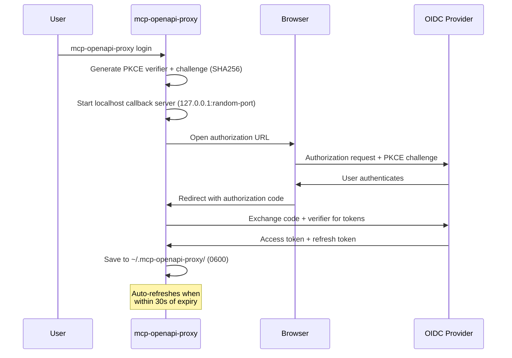

<div align="center">

# mcp-openapi-proxy

**Turn any OpenAPI 3.x spec into a fully functional MCP server — automatically.**

Every REST API has an OpenAPI spec. Every AI agent speaks MCP.<br/>
This bridge connects the two with zero code — point it at a spec, get MCP tools.

[](https://go.dev)
[](LICENSE)
[](https://modelcontextprotocol.io)

</div>

---

## The Problem

You have a REST API with 50+ endpoints and an OpenAPI spec that documents every one of them. You want an AI agent (Claude Code, Codex, Gemini CLI) to call your API through MCP. The standard approach: write one MCP tool definition per endpoint — input schemas, handlers, auth wiring — thousands of lines of boilerplate that breaks every time the API changes.

**mcp-openapi-proxy** eliminates that. One binary. One environment variable pointing to your spec. Every endpoint becomes an MCP tool at startup. No codegen, no generated files, no maintenance.

And authentication makes it worse. Production APIs use OIDC, OAuth2, or token-based auth — the agent needs valid credentials, tokens that expire need refreshing, and secrets need secure storage. mcp-openapi-proxy handles this end-to-end: static tokens for development, browser-based OIDC PKCE for production, with automatic token refresh and secure on-disk storage.

## How It Works

```mermaid
flowchart LR
    A["OpenAPI Spec<br/><small>YAML · JSON · URL</small>"] --> B["Spec Parser<br/><small>kin-openapi</small>"]
    B --> C["Endpoints[]"]
    C --> D["Tool Generator<br/><small>name + schema + handler</small>"]
    D --> E["MCP Server<br/><small>stdio</small>"]
    E <-->|"tool calls"| F["AI Agent<br/><small>Claude · Codex · Gemini</small>"]

    style A fill:#24283b,stroke:#bb9af7,color:#bb9af7
    style B fill:#24283b,stroke:#7dcfff,color:#7dcfff
    style C fill:#24283b,stroke:#e0af68,color:#e0af68
    style D fill:#24283b,stroke:#9ece6a,color:#9ece6a
    style E fill:#24283b,stroke:#bb9af7,color:#bb9af7
    style F fill:#1a1b26,stroke:#7aa2f7,color:#7aa2f7
```

<p align="center">
  
</p>



1. The OpenAPI spec is loaded and parsed into a list of endpoints (method, path, parameters, request body)
2. Each endpoint becomes an MCP tool with a JSON Schema input derived from its parameters and body
3. A handler is generated for each tool that builds the HTTP request and calls your API with auth
4. The MCP server runs over stdio, ready to receive tool calls from any MCP client

## Features

- **OpenAPI 3.x** — parses paths, parameters, request bodies, and security schemes via [kin-openapi](https://github.com/getkin/kin-openapi)
- **Local and remote specs** — load from a file path or any `http://` / `https://` URL
- **One tool per endpoint** — auto-generated with full JSON Schema input validation
- **Tool annotations** — `GET` → read-only, `DELETE` → destructive
- **Production-ready authentication** — built-in OIDC Authorization Code + PKCE flow with browser-based login, automatic token refresh, and secure on-disk storage (`0600`). Works with any OIDC provider: Keycloak, Auth0, Okta, Google, and more. No auth code to write.
- **Development auth** — simple static bearer token via `MCP_AUTH_TOKEN` for local dev and CI
- **Zero-config auth priority** — static token → OIDC from disk → no auth fallback. The proxy resolves credentials automatically at startup.
- **Configurable tool prefix** — namespace tools to avoid collisions when running multiple proxies
- **Extra headers** — inject custom headers (workspace IDs, API versions) into every request
- **stdio transport** — compatible with Claude Code, OpenAI Codex, Gemini CLI, and any MCP client

### What it does NOT do

- **No codegen** — tools are created dynamically at startup, no build step
- **No API modification** — read-only proxy, never changes the spec or backend
- **No response validation** — forwards raw API responses to the agent
- **No OpenAPI 2.0** — only 3.x specs (convert older specs with [swagger2openapi](https://github.com/Mermade/oas-kit))
- **No SSE/WebSocket** — stdio transport only
- **No file uploads** — `multipart/form-data` and `application/x-www-form-urlencoded` endpoints are skipped

## Quick Start

```bash
# Install
go install github.com/rendis/mcp-openapi-proxy/cmd/mcp-openapi-proxy@latest

# Run with a local spec and static token
MCP_SPEC=./openapi.yaml \
MCP_BASE_URL=https://api.example.com \
MCP_AUTH_TOKEN=your-token \
mcp-openapi-proxy
```

## Installation

```bash
go install github.com/rendis/mcp-openapi-proxy/cmd/mcp-openapi-proxy@latest
```

Or build from source:

```bash
git clone https://github.com/rendis/mcp-openapi-proxy.git
go build -C mcp-openapi-proxy -o bin/mcp-openapi-proxy ./cmd/mcp-openapi-proxy
```

## Configuration

All configuration is done through environment variables.

| Variable | Required | Default | Description |
|---|---|---|---|
| `MCP_SPEC` | Yes | — | Path or URL to an OpenAPI 3.x spec (YAML or JSON) |
| `MCP_BASE_URL` | Yes | — | Base URL of the target API |
| `MCP_TOOL_PREFIX` | No | `api` | Prefix for generated tool names |
| `MCP_AUTH_TOKEN` | No | — | Static bearer token (takes priority over OIDC) |
| `MCP_OIDC_ISSUER` | No | — | OIDC issuer URL (used with `login` command) |
| `MCP_OIDC_CLIENT_ID` | No | — | OIDC client ID (used with `login` command) |
| `MCP_EXTRA_HEADERS` | No | — | Comma-separated `key:value` pairs added to every request |

> [!IMPORTANT]
> **Authentication priority:** Static token (`MCP_AUTH_TOKEN`) → OIDC tokens from disk → No auth (warning to stderr).
>
> Trailing slashes on `MCP_BASE_URL` are stripped automatically.

## Commands

| Command | Description |
|---|---|
| `mcp-openapi-proxy` | Start the MCP server (default, same as `serve`) |
| `mcp-openapi-proxy serve` | Start the MCP server explicitly |
| `mcp-openapi-proxy login` | Browser-based OIDC Authorization Code + PKCE login |
| `mcp-openapi-proxy logout` | Remove stored tokens from disk |
| `mcp-openapi-proxy status` | Display current authentication state |

## Usage with AI Agents

<details>
<summary><strong>Claude Code</strong> — <code>.mcp.json</code></summary>

```json
{
  "mcpServers": {
    "my-api": {
      "command": "mcp-openapi-proxy",
      "env": {
        "MCP_SPEC": "./openapi.yaml",
        "MCP_BASE_URL": "https://api.example.com",
        "MCP_TOOL_PREFIX": "myapi",
        "MCP_AUTH_TOKEN": "your-token"
      }
    }
  }
}
```

</details>

<details>
<summary><strong>OpenAI Codex</strong> — <code>.codex/config.toml</code></summary>

```toml
[mcp_servers.my-api]
command = "mcp-openapi-proxy"

[mcp_servers.my-api.env]
MCP_SPEC = "./openapi.yaml"
MCP_BASE_URL = "https://api.example.com"
MCP_TOOL_PREFIX = "myapi"
MCP_AUTH_TOKEN = "your-token"
```

</details>

<details>
<summary><strong>Gemini CLI</strong> — <code>~/.gemini/settings.json</code></summary>

```json
{
  "mcpServers": {
    "my-api": {
      "command": "mcp-openapi-proxy",
      "env": {
        "MCP_SPEC": "./openapi.yaml",
        "MCP_BASE_URL": "https://api.example.com",
        "MCP_TOOL_PREFIX": "myapi",
        "MCP_AUTH_TOKEN": "your-token"
      }
    }
  }
}
```

</details>

## Tool Naming

Each endpoint becomes an MCP tool with the naming pattern:

```
{prefix}_{method}_{sanitized_path}
```

Path segments are lowercased. Special characters (`/`, `-`, `{`, `}`, `.`) are replaced with underscores. Consecutive underscores are collapsed.

| Method | Path | Prefix | Tool Name |
|---|---|---|---|
| GET | `/users` | `api` | `api_get_users` |
| POST | `/users` | `api` | `api_post_users` |
| GET | `/users/{id}` | `api` | `api_get_users_id` |
| PUT | `/users/{id}/roles` | `api` | `api_put_users_id_roles` |
| DELETE | `/admin/features/{key}` | `fe` | `fe_delete_admin_features_key` |
| GET | `/v1/health.check` | `svc` | `svc_get_v1_health_check` |

### Input Schema

Each tool receives a flat JSON object as input:

- **Path parameters** → top-level properties: `{"id": "abc123"}` (values are URL-encoded automatically)
- **Query parameters** → top-level properties: `{"page": 1, "limit": 20}` (arrays use repeated keys: `tags=a&tags=b`)
- **Header parameters** → top-level properties: `{"X-Request-Id": "req-001"}` (injected as HTTP headers)
- **Request body** → nested under `body`: `{"body": {"name": "new user"}}`

Required parameters from the OpenAPI spec are enforced in the tool's JSON Schema.

**Example** — `PUT /users/{id}` with query and body:

```json
{
  "id": "abc123",
  "include_roles": true,
  "body": {
    "name": "Jane Doe",
    "email": "jane@example.com"
  }
}
```

## Authentication

Most MCP server implementations require you to handle authentication yourself — embedding tokens in environment variables, writing refresh logic, managing secrets. mcp-openapi-proxy handles the full authentication lifecycle so your AI agent can call protected APIs without any auth code in your project.

### Static Token (Development)

Set `MCP_AUTH_TOKEN` to any bearer token. The proxy sends it as `Authorization: Bearer <token>` on every request.

```bash
MCP_AUTH_TOKEN=dev-token mcp-openapi-proxy
```

### OIDC PKCE (Production)

For production APIs protected by an OIDC provider, the proxy includes a browser-based login flow using [Authorization Code + PKCE](https://oauth.net/2/pkce/) — the most secure OAuth 2.0 flow for public clients. No client secret is needed; authentication relies on a cryptographic code verifier that proves the login was initiated by the same process.



#### Discovery Modes

The `login` command needs to know the OIDC provider's authorization and token endpoints. Two discovery modes are supported:

**Standard OIDC discovery (recommended)** — works with any OIDC provider (Keycloak, Auth0, Okta, Google, etc.):

```bash
MCP_OIDC_ISSUER=https://auth.example.com/realms/myrealm \
MCP_OIDC_CLIENT_ID=my-client \
mcp-openapi-proxy login
```

Fetches `{issuer}/.well-known/openid-configuration` and extracts `authorization_endpoint` and `token_endpoint`. This is the [standard OIDC Discovery](https://openid.net/specs/openid-connect-discovery-1_0.html) mechanism.

**Application-specific discovery** — for APIs that expose a proprietary config endpoint:

```bash
MCP_BASE_URL=https://api.example.com mcp-openapi-proxy login
```

Fetches `{baseURL}/api/v1/auth/config` and parses the OIDC provider configuration from the response. This mode only works if your API implements this specific endpoint.

> [!NOTE]
> The `MCP_BASE_URL`-only mode is a proprietary extension, not standard OIDC. Use `MCP_OIDC_ISSUER` + `MCP_OIDC_CLIENT_ID` for any generic OIDC provider.

#### Login

The login command opens a browser window, starts a temporary localhost callback server, and waits up to **5 minutes** for the user to authenticate. If the browser doesn't open automatically, the authorization URL is printed to stderr for manual use.

Platform support: macOS (`open`), Linux (`xdg-open`), Windows (`rundll32`).

#### Scopes

Default scopes requested: `openid profile email offline_access`.

The `offline_access` scope is always enforced — if your custom scopes omit it, the proxy appends it automatically. This ensures the provider returns a refresh token for automatic renewal.

#### Token Storage

Tokens are stored at `~/.mcp-openapi-proxy/mcp-openapi-proxy-tokens.json`:

```json
{
  "access_token": "eyJhbGci...",
  "refresh_token": "dGhpcyBp...",
  "expires_at": "2026-03-22T15:30:00Z",
  "token_endpoint": "https://auth.example.com/token",
  "client_id": "my-client"
}
```

- **File permissions:** `0600` (user read/write only)
- **Directory permissions:** `0700`
- **Writes are atomic:** temp file + `rename` to prevent corruption from concurrent processes

#### Token Refresh

The proxy automatically refreshes tokens before they expire:

- **Refresh margin:** 30 seconds before `expires_at`
- **Refresh timeout:** 15 seconds per attempt
- **Detached context:** refresh uses `context.Background()` so it won't be cancelled if the agent times out the tool call
- **Fallback on failure:** if refresh fails but the current token hasn't expired yet, the existing token is used silently
- **Missing `expires_in`:** if the provider omits `expires_in` from the refresh response, defaults to 1 hour

#### Status and Logout

```bash
# Show current auth state
mcp-openapi-proxy status

# Example output:
# Status: logged in
# Token file:     ~/.mcp-openapi-proxy/mcp-openapi-proxy-tokens.json
# Token endpoint: https://auth.example.com/token
# Client ID:      my-client
# Expires at:     2026-03-22T15:30:00Z
# Remaining:      23m14s
# Refresh token:  present (auto-refresh enabled)
```

```bash
# Remove stored tokens (idempotent — safe to run if already logged out)
mcp-openapi-proxy logout
```

#### OIDC Troubleshooting

| Symptom | Cause | Fix |
|---|---|---|
| `OIDC discovery from ... failed` | Issuer URL wrong or unreachable | Verify `MCP_OIDC_ISSUER` URL, check `/.well-known/openid-configuration` is accessible |
| `token endpoint returned 400: ...` | Wrong client ID, expired code, or PKCE mismatch | Check `MCP_OIDC_CLIENT_ID`, run `login` again |
| `login timed out after 5m0s` | Browser didn't redirect back in time | Check firewall/proxy rules, try the URL printed to stderr manually |
| `no refresh token received` | Provider not returning refresh tokens | Ensure `offline_access` scope is allowed in your provider config |
| `API is in dummy-auth mode` | API discovery returned `dummyAuth=true` | Use `MCP_AUTH_TOKEN` with a static token instead |
| `access token expired and no refresh token` | Refresh token was never stored | Re-run `login` to obtain fresh tokens with `offline_access` |
| `token refresh failed` | Token endpoint unreachable or refresh token revoked | Check network, re-run `login` |

## Architecture

<p align="center">
  
</p>

```
cmd/mcp-openapi-proxy/       Entry point, CLI subcommands, env var parsing
pkg/
  spec/                      OpenAPI 3.x parser (kin-openapi)
    parser.go                Loads spec from file or URL, extracts endpoints
  server/                    MCP server setup and tool generation
    server.go                Creates MCP server, runs stdio transport
    generator.go             Converts endpoints to MCP tools, builds handlers
  auth/                      Authentication providers
    provider.go              TokenProvider interface + StaticTokenProvider
    oidc_provider.go         OIDC token storage, loading, and transparent refresh
    discovery.go             OIDC .well-known/openid-configuration discovery
    login.go                 Browser-based OIDC Authorization Code + PKCE flow
    logout.go                Token file removal
    status.go                Print current auth state
  client/                    HTTP client for API calls
    client.go                Bearer auth, extra headers, response handling (JSON + raw text)
    errors.go                API error parsing
```

### Request Lifecycle

1. Agent calls a tool (e.g. `api_get_users_id` with `{"id": "abc123", "include_roles": true}`)
2. Handler substitutes path parameters: `/users/{id}` → `/users/abc123` (values are URL-encoded)
3. Query parameters are URL-encoded: `?include_roles=true` (arrays use repeated keys: `tags=a&tags=b`)
4. Request body (if present) is extracted from the `body` property and marshaled to JSON
5. HTTP client sends the request with `Authorization: Bearer <token>` and any extra headers
6. Response returned as a structured envelope:
   ```json
   {"status": 200, "content_type": "application/json", "headers": {"X-Total-Count": "42"}, "body": {...}}
   ```
   - JSON body → parsed object in `body`
   - Non-JSON (`text/plain`, `text/html`) → raw text string in `body`
   - Empty `2xx` → `body` is `{"status": "ok"}`
   - `4xx/5xx` → `APIError` with status code and response body

### What the Agent Sees

Each tool exposes the full API contract:

- **InputSchema** — path, query, header, and cookie params as top-level properties + body nested under `"body"`, with constraints (enum, format, min/max)
- **OutputSchema** — JSON Schema of the success response (derived from the first `2xx` response in the spec)
- **Description** — HTTP method, path, summary, response status codes with descriptions, auth requirements, and external docs URL
- **Annotations** — `GET` → read-only, `DELETE` → destructive
- **Deprecated endpoints** — skipped entirely, never registered as tools

## Examples

<details>
<summary><strong>Feature Flags API</strong></summary>

```json
{
  "mcpServers": {
    "feature-flags": {
      "command": "mcp-openapi-proxy",
      "env": {
        "MCP_SPEC": "https://api.flags.example.com/openapi.yaml",
        "MCP_BASE_URL": "https://api.flags.example.com",
        "MCP_TOOL_PREFIX": "ff",
        "MCP_EXTRA_HEADERS": "X-Workspace:my-workspace"
      }
    }
  }
}
```

</details>

<details>
<summary><strong>Mock Server (Local Development)</strong></summary>

```json
{
  "mcpServers": {
    "mock": {
      "command": "mcp-openapi-proxy",
      "env": {
        "MCP_SPEC": "./api/openapi.yaml",
        "MCP_BASE_URL": "http://localhost:4010",
        "MCP_TOOL_PREFIX": "mock",
        "MCP_AUTH_TOKEN": "dev-token"
      }
    }
  }
}
```

</details>

<details>
<summary><strong>Multiple APIs Side by Side</strong></summary>

Use distinct prefixes to run multiple proxies without tool name collisions:

```json
{
  "mcpServers": {
    "users-api": {
      "command": "mcp-openapi-proxy",
      "env": {
        "MCP_SPEC": "./specs/users.yaml",
        "MCP_BASE_URL": "https://users.example.com",
        "MCP_TOOL_PREFIX": "users",
        "MCP_AUTH_TOKEN": "token-a"
      }
    },
    "billing-api": {
      "command": "mcp-openapi-proxy",
      "env": {
        "MCP_SPEC": "./specs/billing.yaml",
        "MCP_BASE_URL": "https://billing.example.com",
        "MCP_TOOL_PREFIX": "billing",
        "MCP_AUTH_TOKEN": "token-b"
      }
    }
  }
}
```

</details>

## Agent Skill

This project includes an LLM agent skill that teaches agents how to install, configure, and use mcp-openapi-proxy. The skill lives at `skills/mcp-openapi-proxy/SKILL.md`.

Install globally so it's available in every project:

```bash
npx skills add --global https://github.com/rendis/mcp-openapi-proxy --skill mcp-openapi-proxy
```

Once installed, agents automatically know how to set up MCP servers from OpenAPI specs, configure authentication, and wire up multiple APIs. The skill covers installation, environment variable reference, MCP client setup (Claude Code, Codex, Gemini CLI), authentication, tool naming conventions, running multiple APIs, and common mistakes.

## Troubleshooting

| Symptom | Cause | Fix |
|---|---|---|
| `MCP_SPEC environment variable is required` | Missing `MCP_SPEC` env var | Set `MCP_SPEC` to a path or URL pointing to your OpenAPI 3.x spec |
| `MCP_BASE_URL environment variable is required` | Missing `MCP_BASE_URL` env var | Set `MCP_BASE_URL` to your API's base URL |
| `load spec:` ... | Spec file not found or URL unreachable | Check the file path or URL; verify network/VPN if remote |
| `401 Unauthorized` on tool calls | No auth configured or token expired | Set `MCP_AUTH_TOKEN` or run `mcp-openapi-proxy login` for OIDC |
| Tool not found for an endpoint | Endpoint uses `multipart/form-data` or `x-www-form-urlencoded` | These endpoints are skipped; not supported |
| Parse error on spec | Spec is Swagger 2.0, not OpenAPI 3.x | Convert with [swagger2openapi](https://github.com/Mermade/oas-kit) first |
| `warning: no auth token configured` | No `MCP_AUTH_TOKEN` and no prior OIDC login | Expected if your API doesn't require auth; otherwise set a token |

## Tech Stack

| Component | Purpose |
|---|---|
| [Go 1.26+](https://go.dev) | Runtime |
| [kin-openapi](https://github.com/getkin/kin-openapi) | OpenAPI 3.x parsing |
| [go-sdk](https://github.com/modelcontextprotocol/go-sdk) | MCP server implementation |
| [jsonschema-go](https://github.com/google/jsonschema-go) | JSON Schema for tool inputs |

## Contributing

Contributions are welcome.

1. Fork the repository
2. Create a feature branch (`git checkout -b feature/my-feature`)
3. Commit your changes
4. Push to the branch and open a Pull Request

> [!NOTE]
> Please include tests for any changes. Run `go test ./...` to verify.

## License

MIT
