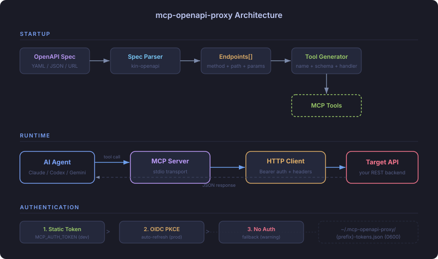
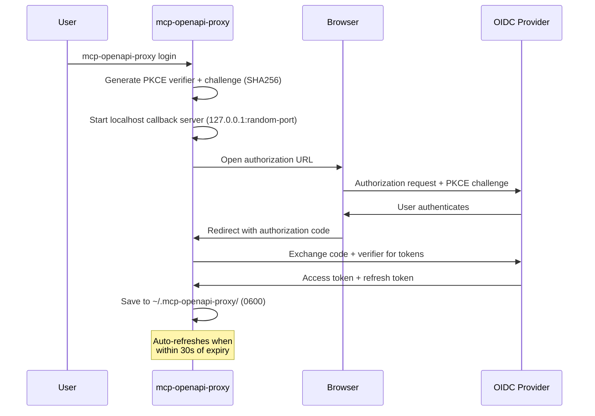

<div align="center">

# mcp-openapi-proxy

**Turn any OpenAPI 3.x spec into a lightweight MCP navigator/executor server — automatically.**

Every REST API has an OpenAPI spec. Every AI agent speaks MCP.<br/>
This bridge connects the two with zero code — point it at a spec, get a usable MCP navigator/executor.

[](https://go.dev)
[](LICENSE)
[](https://modelcontextprotocol.io)

</div>

---

## The Problem

You have a REST API with 50+ endpoints and an OpenAPI spec that documents every one of them. You want an AI agent (Claude Code, Codex, Gemini CLI) to call your API through MCP. The standard approach: write one MCP tool definition per endpoint — input schemas, handlers, auth wiring — thousands of lines of boilerplate that breaks every time the API changes.

**mcp-openapi-proxy** eliminates that. One binary. One environment variable pointing to your spec. The proxy indexes every endpoint at startup, then exposes a small MCP navigator/executor surface that agents can actually load. No codegen, no generated files, no maintenance.

And authentication makes it worse. Production APIs use OIDC, OAuth2, or token-based auth — the agent needs valid credentials, tokens that expire need refreshing, and secrets need secure storage. mcp-openapi-proxy handles this end-to-end: static tokens for development, browser-based OIDC PKCE for production, with automatic token refresh and secure on-disk storage.

## How It Works

```mermaid
flowchart LR
    A["OpenAPI Spec<br/><small>YAML · JSON · URL</small>"] --> B["Spec Parser<br/><small>kin-openapi</small>"]
    B --> C["Endpoints[]"]
    C --> D["Endpoint Index<br/><small>toolName + metadata</small>"]
    D --> E["3 MCP Tools<br/><small>list · describe · call</small>"]
    E <-->|"tool calls"| F["AI Agent<br/><small>Claude · Codex · Gemini</small>"]

    style A fill:#24283b,stroke:#bb9af7,color:#bb9af7
    style B fill:#24283b,stroke:#7dcfff,color:#7dcfff
    style C fill:#24283b,stroke:#e0af68,color:#e0af68
    style D fill:#24283b,stroke:#9ece6a,color:#9ece6a
    style E fill:#24283b,stroke:#bb9af7,color:#bb9af7
    style F fill:#1a1b26,stroke:#7aa2f7,color:#7aa2f7
```

<p align="center">
  
</p>



1. The OpenAPI spec is loaded and parsed into a list of endpoints (method, path, parameters, request body)
2. Each endpoint gets a stable `toolName` identifier using `{prefix}_{method}_{sanitized_path}`
3. The proxy registers exactly three MCP tools: `list_endpoints`, `describe_endpoint`, and `call_endpoint`
4. Agents discover endpoints cheaply, fetch the full contract only when needed, and execute calls through the shared HTTP runtime

## Features

- **OpenAPI 3.x** — parses paths, parameters, request bodies, and security schemes via [kin-openapi](https://github.com/getkin/kin-openapi)
- **Local and remote specs** — load from a file path or any `http://` / `https://` URL
- **Navigator/executor MCP surface** — exactly 3 tools per server, regardless of API size
- **Stable endpoint identifiers** — every endpoint still gets a deterministic `toolName`
- **Production-ready authentication** — built-in OIDC Authorization Code + PKCE flow with browser-based login, automatic token refresh, and secure on-disk storage (`0600`). Works with any OIDC provider: Keycloak, Auth0, Okta, Google, and more. No auth code to write.
- **Development auth** — static bearer token via `MCP_AUTH_TOKEN` or per-scheme credentials via `MCP_AUTH_<SCHEME>_*`
- **Spec-aware auth resolution** — resolves `http bearer`, `http basic`, `apiKey`, `oauth2`, and `openIdConnect` from OpenAPI security requirements
- **Configurable tool prefix** — namespace tools to avoid collisions when running multiple proxies
- **Extra headers** — inject custom headers (workspace IDs, API versions) into every request
- **Lightweight discovery** — `tools/list` stays small while `describe_endpoint` exposes the full OpenAPI contract on demand
- **Structured call output** — `call_endpoint` returns a typed envelope with `status`, `content_type`, `headers`, and `body`
- **Native image and audio content** — `image/*` and `audio/*` responses are also surfaced as native MCP `ImageContent` / `AudioContent` blocks so capable clients can render them inline
- **Forms and binary payloads** — supports `multipart/form-data`, `application/x-www-form-urlencoded`, text payloads, and `application/octet-stream`
- **stdio transport** — compatible with Claude Code, OpenAI Codex, Gemini CLI, and any MCP client

### What it does NOT do

- **No codegen** — tools are created dynamically at startup, no build step
- **No API modification** — read-only proxy, never changes the spec or backend
- **No response rewriting** — returns the real API response envelope, even when the backend deviates from the spec
- **No OpenAPI 2.0** — only 3.x specs (convert older specs with [swagger2openapi](https://github.com/Mermade/oas-kit))
- **No SSE/WebSocket** — stdio transport only

## Quick Start

```bash
# Install
go install github.com/rendis/mcp-openapi-proxy/cmd/mcp-openapi-proxy@latest

# Run with a local spec and static token
MCP_SPEC=./openapi.yaml \
MCP_BASE_URL=https://api.example.com \
MCP_AUTH_TOKEN=your-token \
mcp-openapi-proxy
```

If `MCP_BASE_URL` is omitted, the proxy falls back to a single absolute server declared in the OpenAPI spec when one can be resolved unambiguously.

### Minimal setup flow

1. Install the binary:

   ```bash
   go install github.com/rendis/mcp-openapi-proxy/cmd/mcp-openapi-proxy@latest
   ```

2. Choose your MCP client setup:
   - Claude Code: copy [`.mcp.json.example`](./.mcp.json.example) into your project as `.mcp.json`
   - Codex global: register the server with `codex mcp add ...`
   - Codex project-local: create `./.codex/config.toml` manually

3. Choose one auth path:
   - Static token: add `MCP_AUTH_TOKEN` to the MCP client config
   - OIDC login: add `MCP_OIDC_ISSUER` and `MCP_OIDC_CLIENT_ID` to the MCP client config, then run one of:
     - `mcp-openapi-proxy login`
     - `mcp-openapi-proxy login <mcp_name>`
     - `mcp-openapi-proxy login --mcp-config ./path/to/.mcp.json`
     - `mcp-openapi-proxy login --mcp-config ./path/to/.mcp.json --server <mcp_name>`
     - `mcp-openapi-proxy login --codex-server <name>`
     - `mcp-openapi-proxy login --codex-config ~/.codex/config.toml`
     - `mcp-openapi-proxy login --codex-config ~/.codex/config.toml --server <name>`

4. Open your MCP client and use the server through `list_endpoints`, `describe_endpoint`, and `call_endpoint`.

When `login` is invoked with `.mcp.json` or Codex config support, it reads the selected server’s `env` from that config entry. If the same variable is present in both places, the shell environment wins.

Plain `mcp-openapi-proxy login` stays env-first for compatibility. When shell env is not enough, it falls back in this order:

1. `./.mcp.json`
2. `~/.codex/config.toml` (or `$CODEX_HOME/config.toml`)

If the server name is omitted, `login` discovers eligible entries from the selected config file:

- direct `command: "mcp-openapi-proxy"`
- direct paths such as `"/path/to/bin/mcp-openapi-proxy"` or `"C:\\tools\\mcp-openapi-proxy.exe"`

Wrapper commands such as `go`, `env`, `docker`, or shell scripts are ignored on purpose. If more than one eligible server exists, `login` shows the available names and prompts you to choose one.

### If your spec comes from `swag init`

`swag init` generates Swagger 2.0 output. `mcp-openapi-proxy` only accepts OpenAPI 3.x specs, so do not point `MCP_SPEC` directly at the generated `swagger.json`.

Convert it first, then use the converted OpenAPI 3.x file:

```bash
swag init -g cmd/api/main.go
swagger2openapi ./docs/swagger.json -o ./docs/openapi.json
MCP_SPEC=./docs/openapi.json mcp-openapi-proxy
```

## Installation

```bash
go install github.com/rendis/mcp-openapi-proxy/cmd/mcp-openapi-proxy@latest
```

Or build from source:

```bash
git clone https://github.com/rendis/mcp-openapi-proxy.git
go build -C mcp-openapi-proxy -o bin/mcp-openapi-proxy ./cmd/mcp-openapi-proxy
```

## Configuration

All configuration is done through environment variables.

| Variable | Required | Default | Description |
|---|---|---|---|
| `MCP_SPEC` | Yes | — | Path or URL to an OpenAPI 3.x spec (YAML or JSON) |
| `MCP_BASE_URL` | No | — | Explicit API base URL. If omitted, the proxy uses a single absolute OpenAPI server when available |
| `MCP_TOOL_PREFIX` | No | `api` | Prefix for the 3 MCP navigator tools and for endpoint `toolName` identifiers |
| `MCP_AUTH_PROFILE` | No | `MCP_TOOL_PREFIX` or `default` | Namespace for stored OIDC tokens |
| `MCP_AUTH_TOKEN` | No | — | Global bearer token fallback |
| `MCP_OIDC_ISSUER` | No | — | OIDC issuer URL (used with `login` command) |
| `MCP_OIDC_CLIENT_ID` | No | — | OIDC client ID (used with `login` command) |
| `MCP_OIDC_SCOPES` | No | Scopes discovered from `MCP_SPEC` or `openid profile email offline_access` | Override OIDC login scopes |
| `MCP_EXTRA_HEADERS` | No | — | Comma-separated `key:value` pairs added to every request |
| `MCP_MAX_BODY_BYTES` | No | `10485760` | Maximum response body size to buffer and return |
| `MCP_ALLOW_INSECURE_HTTP` | No | `0` | Allow sending resolved credentials over non-loopback `http://` URLs |
| `MCP_EXCLUDE_DEPRECATED` | No | `0` | Skip deprecated endpoints when generating tools |

> [!IMPORTANT]
> **Auth resolution:** `MCP_AUTH_<SCHEME>_*` → global `MCP_AUTH_TOKEN` → OIDC token cache for `MCP_AUTH_PROFILE`.
>
> Trailing slashes on `MCP_BASE_URL` are stripped automatically.

## Commands

| Command | Description |
|---|---|
| `mcp-openapi-proxy` | Start the MCP server (default, same as `serve`) |
| `mcp-openapi-proxy serve` | Start the MCP server explicitly |
| `mcp-openapi-proxy login` | Browser-based OIDC Authorization Code + PKCE login |
| `mcp-openapi-proxy login <mcp_name>` | Run login using `./.mcp.json` and `mcpServers.<mcp_name>.env` |
| `mcp-openapi-proxy login --mcp-config <path>` | Run login using an MCP config file, auto-selecting or prompting for an eligible `mcp-openapi-proxy` server |
| `mcp-openapi-proxy login --mcp-config <path> --server <mcp_name>` | Run login using a selected server from an MCP config file |
| `mcp-openapi-proxy login --codex-config <path>` | Run login using a Codex TOML config, auto-selecting or prompting for an eligible `mcp-openapi-proxy` server |
| `mcp-openapi-proxy login --codex-config <path> --server <name>` | Run login using a selected server from a Codex TOML config |
| `mcp-openapi-proxy login --codex-server <name>` | Run login using `~/.codex/config.toml` (or `$CODEX_HOME/config.toml`) and `mcp_servers.<name>.env` |
| `mcp-openapi-proxy logout` | Remove stored tokens from disk |
| `mcp-openapi-proxy status` | Display current authentication state |

## Usage with AI Agents

<details>
<summary><strong>Claude Code</strong> — <code>.mcp.json</code></summary>

Generic example:

```json
{
  "mcpServers": {
    "my-api": {
      "command": "mcp-openapi-proxy",
      "env": {
        "MCP_SPEC": "./openapi.yaml",
        "MCP_BASE_URL": "https://api.example.com",
        "MCP_TOOL_PREFIX": "myapi",
        "MCP_AUTH_PROFILE": "myapi"
      }
    }
  }
}
```

Static token variant:

```json
{
  "mcpServers": {
    "my-api": {
      "command": "mcp-openapi-proxy",
      "env": {
        "MCP_SPEC": "./openapi.yaml",
        "MCP_BASE_URL": "https://api.example.com",
        "MCP_TOOL_PREFIX": "myapi",
        "MCP_AUTH_PROFILE": "myapi",
        "MCP_AUTH_TOKEN": "your-token"
      }
    }
  }
}
```

OIDC variant:

```json
{
  "mcpServers": {
    "my-api": {
      "command": "mcp-openapi-proxy",
      "env": {
        "MCP_SPEC": "./openapi.yaml",
        "MCP_BASE_URL": "https://api.example.com",
        "MCP_TOOL_PREFIX": "myapi",
        "MCP_AUTH_PROFILE": "myapi",
        "MCP_OIDC_ISSUER": "https://auth.example.com/realms/myrealm",
        "MCP_OIDC_CLIENT_ID": "my-client"
      }
    }
  }
}
```

If you use the OIDC variant, run login once before starting Claude Code. You can now do that directly from the `.mcp.json` entry:

```bash
mcp-openapi-proxy login
```

Or select the server explicitly:

```bash
mcp-openapi-proxy login my-api
```

Or against an explicit config path:

```bash
mcp-openapi-proxy login --mcp-config ./path/to/.mcp.json
```

Or with an explicit config path plus explicit server:

```bash
mcp-openapi-proxy login --mcp-config ./path/to/.mcp.json --server my-api
```

When the server name is omitted, `login` only considers `.mcp.json` entries whose `command` is a direct `mcp-openapi-proxy` binary or path to that binary. Wrapper commands such as `go`, `env`, `docker`, or shell scripts are not used for login discovery.

Equivalent env-only form:

```bash
MCP_AUTH_PROFILE=myapi \
MCP_OIDC_ISSUER=https://auth.example.com/realms/myrealm \
MCP_OIDC_CLIENT_ID=my-client \
mcp-openapi-proxy login
```

</details>

<details>
<summary><strong>OpenAI Codex</strong> — <code>.codex/config.toml</code></summary>

Global install via Codex CLI:

```bash
codex mcp add my-api \
  --env MCP_SPEC=./openapi.yaml \
  --env MCP_BASE_URL=https://api.example.com \
  --env MCP_TOOL_PREFIX=myapi \
  --env MCP_AUTH_TOKEN=your-token \
  -- mcp-openapi-proxy
```

OIDC variant via Codex CLI:

```bash
codex mcp add my-api \
  --env MCP_SPEC=./openapi.yaml \
  --env MCP_BASE_URL=https://api.example.com \
  --env MCP_TOOL_PREFIX=myapi \
  --env MCP_AUTH_PROFILE=myapi \
  --env MCP_OIDC_ISSUER=https://auth.example.com/realms/myrealm \
  --env MCP_OIDC_CLIENT_ID=my-client \
  -- mcp-openapi-proxy
```

Codex CLI writes the global server entry to `~/.codex/config.toml`.

Project-local Codex config is manual because the visible `codex mcp add` help does not expose a project-scoped install mode. Create `./.codex/config.toml` yourself when you want repo-local configuration:

```toml
[mcp_servers.my-api]
command = "mcp-openapi-proxy"

[mcp_servers.my-api.env]
MCP_SPEC = "./openapi.yaml"
MCP_BASE_URL = "https://api.example.com"
MCP_TOOL_PREFIX = "myapi"
MCP_AUTH_TOKEN = "your-token"
```

OIDC login for Codex-managed entries is still done with `mcp-openapi-proxy login`, not `codex mcp login`:

```bash
mcp-openapi-proxy login --codex-server my-api
```

Or against an explicit Codex config file:

```bash
mcp-openapi-proxy login --codex-config ~/.codex/config.toml
mcp-openapi-proxy login --codex-config ~/.codex/config.toml --server my-api
mcp-openapi-proxy login --codex-config ./.codex/config.toml --server my-api
```

`codex mcp login` is for OAuth flows that Codex manages itself. For this stdio server, keep using `mcp-openapi-proxy login` so the proxy can perform OIDC discovery, PKCE, and token storage.

> [!NOTE]
> Codex has the concept of project `config.toml` files and can ignore them in untrusted folders. If a local `./.codex/config.toml` entry does not load, either use the global `~/.codex/config.toml` path or work from a trusted project.

</details>

<details>
<summary><strong>Gemini CLI</strong> — <code>~/.gemini/settings.json</code></summary>

```json
{
  "mcpServers": {
    "my-api": {
      "command": "mcp-openapi-proxy",
      "env": {
        "MCP_SPEC": "./openapi.yaml",
        "MCP_BASE_URL": "https://api.example.com",
        "MCP_TOOL_PREFIX": "myapi",
        "MCP_AUTH_TOKEN": "your-token"
      }
    }
  }
}
```

</details>

## MCP Surface

The server always registers exactly these 3 MCP tools:

| Tool | Purpose |
|---|---|
| `{prefix}_list_endpoints` | Lightweight discovery with filtering and pagination |
| `{prefix}_describe_endpoint` | Full OpenAPI contract for one endpoint |
| `{prefix}_call_endpoint` | Execute one endpoint by `toolName` |

Agents should always inspect these registered tools first. The proxy no longer exposes one MCP tool per endpoint.

### Endpoint IDs

Each OpenAPI operation still gets a stable identifier called `toolName`:

```
{prefix}_{method}_{sanitized_path}
```

Path segments are lowercased. Special characters (`/`, `-`, `{`, `}`, `.`) are replaced with underscores. Consecutive underscores are collapsed.

| Method | Path | Prefix | Endpoint `toolName` |
|---|---|---|---|
| GET | `/users` | `api` | `api_get_users` |
| POST | `/users` | `api` | `api_post_users` |
| GET | `/users/{id}` | `api` | `api_get_users_id` |
| DELETE | `/admin/features/{key}` | `fe` | `fe_delete_admin_features_key` |
| GET | `/v1/health.check` | `svc` | `svc_get_v1_health_check` |

`toolName` is the identifier passed to `describe_endpoint` and `call_endpoint`. It is no longer a registered MCP tool by itself.

### Discovery Flow

Recommended agent flow:

1. Call `{prefix}_list_endpoints` to find candidate endpoints quickly
2. Call `{prefix}_describe_endpoint` for the exact endpoint contract
3. Call `{prefix}_call_endpoint` with `toolName` plus `path/query/headers/cookies/body`

**Feature Flags API example** with `MCP_TOOL_PREFIX=fe`:

| Operation | Endpoint `toolName` |
|---|---|
| `GET /admin/features` | `fe_get_admin_features` |
| `POST /admin/features` | `fe_post_admin_features` |
| `GET /admin/features/{key}` | `fe_get_admin_features_key` |
| `PATCH /admin/features/{key}/toggle` | `fe_patch_admin_features_key_toggle` |
| `GET /admin/workspaces` | `fe_get_admin_workspaces` |

There is no semantic alias layer in the product. Do not invent names from verbs like `list`, `create`, or `toggle`.

### `list_endpoints`

Input:

```json
{
  "q": "feature",
  "tag": "admin",
  "path_prefix": "/admin",
  "method": "PATCH",
  "auth": "bearer",
  "deprecated": false,
  "cursor": "Mg",
  "limit": 25
}
```

Output:

```json
{
  "items": [
    {
      "toolName": "fe_patch_admin_features_key_toggle",
      "method": "PATCH",
      "path": "/admin/features/{key}/toggle",
      "description": "Toggle a feature flag",
      "requiredAuth": "bearer",
      "tags": ["flags", "admin"],
      "deprecated": false
    }
  ],
  "nextCursor": ""
}
```

### `describe_endpoint`

Input:

```json
{
  "toolName": "fe_patch_admin_features_key_toggle"
}
```

Output includes the full normalized contract for that endpoint:

- `toolName`, `method`, `path`, `summary`, `description`, `deprecated`
- `requiredAuth` and full `securityRequirements`
- `parameters.path/query/headers/cookies` with schemas by location
- `requestBody` with media types, schema, examples, and encoding hints
- `responses` with status, description, headers, and body schemas
- `externalDocs`, `servers`, `baseURLHint`

### `call_endpoint`

Input:

```json
{
  "toolName": "fe_patch_admin_features_key_toggle",
  "path": {
    "key": "checkout"
  },
  "headers": {
    "X-Workspace": "acme"
  },
  "body": {
    "enabled": true
  }
}
```

Workspace context is passed as a header per request, for example `headers: {"X-Workspace": "acme"}`, or globally through `MCP_EXTRA_HEADERS`. There is no separate `set_workspace` tool.

`call_endpoint` returns the same envelope in both MCP `StructuredContent` and pretty JSON text:

```json
{
  "status": 200,
  "content_type": "application/json",
  "headers": {
    "X-Trace": ["abc123"]
  },
  "body": {
    "id": "item-1"
  }
}
```

- API `4xx/5xx` responses set `IsError=true` but preserve the real HTTP response
- Proxy/runtime failures return `status: 0` plus a `proxy_error` object
- Binary responses are wrapped as `{ "encoding": "base64", "data_base64": "...", "size_bytes": 123 }` inside the envelope `body`
- `image/*` and `audio/*` responses additionally emit a native MCP `ImageContent` / `AudioContent` block alongside the text envelope (`Content[0]` is still the JSON envelope so existing consumers keep working)

## Authentication

Most MCP server implementations require you to handle authentication yourself — embedding tokens in environment variables, writing refresh logic, managing secrets. mcp-openapi-proxy handles the full authentication lifecycle so your AI agent can call protected APIs without any auth code in your project.

### Static Token (Development)

Set `MCP_AUTH_TOKEN` to any bearer token. The proxy sends it as `Authorization: Bearer <token>` when a bearer-compatible security requirement needs it.

```bash
MCP_AUTH_TOKEN=dev-token mcp-openapi-proxy
```

If you use Claude Code, the same token can be placed directly in `.mcp.json` under `env.MCP_AUTH_TOKEN`. For shared repositories, prefer keeping the token outside version control and injecting it locally.

### Per-Scheme Credentials

When an endpoint declares named OpenAPI security schemes, the proxy can resolve credentials per scheme instead of using the global bearer fallback.

Supported patterns:

- `http bearer`, `oauth2`, `openIdConnect` → `MCP_AUTH_<SCHEME>_TOKEN`
- `http basic` → `MCP_AUTH_<SCHEME>_USERNAME` and `MCP_AUTH_<SCHEME>_PASSWORD`
- `apiKey` → `MCP_AUTH_<SCHEME>_KEY`

Scheme names are uppercased and sanitized by replacing `.`, `-`, `/`, and spaces with underscores. Example: `partner-auth/v2` → `PARTNER_AUTH_V2`.

```bash
# http bearer / oauth2 / openIdConnect
MCP_AUTH_PARTNER_AUTH_V2_TOKEN=secret-token

# http basic
MCP_AUTH_ADMIN_BASIC_USERNAME=alice
MCP_AUTH_ADMIN_BASIC_PASSWORD=s3cr3t

# apiKey
MCP_AUTH_X_API_KEY_KEY=dev-key
```

The proxy injects each resolved credential according to the OpenAPI scheme definition: `Authorization` header for bearer/basic, or header/query/cookie placement for `apiKey`.

### OIDC PKCE (Production)

For production APIs protected by an OIDC provider, the proxy includes a browser-based login flow using [Authorization Code + PKCE](https://oauth.net/2/pkce/) — the most secure OAuth 2.0 flow for public clients. No client secret is needed; authentication relies on a cryptographic code verifier that proves the login was initiated by the same process.



#### Discovery Modes

The `login` command needs to know the OIDC provider's authorization and token endpoints. Two discovery modes are supported:

**Standard OIDC discovery (recommended)** — works with any OIDC provider (Keycloak, Auth0, Okta, Google, etc.):

```bash
MCP_OIDC_ISSUER=https://auth.example.com/realms/myrealm \
MCP_OIDC_CLIENT_ID=my-client \
mcp-openapi-proxy login
```

When you use an MCP client config file such as `.mcp.json` or Codex TOML, all of these forms can read the selected server’s `env` automatically:

- `mcp-openapi-proxy login`
- `mcp-openapi-proxy login my-api`
- `mcp-openapi-proxy login --mcp-config ./path/to/.mcp.json`
- `mcp-openapi-proxy login --mcp-config ./path/to/.mcp.json --server my-api`
- `mcp-openapi-proxy login --codex-server my-api`
- `mcp-openapi-proxy login --codex-config ~/.codex/config.toml`
- `mcp-openapi-proxy login --codex-config ~/.codex/config.toml --server my-api`

If the server name is omitted, `login` discovers only direct `mcp-openapi-proxy` commands from the selected config file (binary name or full path, including `.exe` on Windows). Wrapper commands such as `go`, `env`, `docker`, or shell scripts are intentionally ignored. When multiple eligible entries exist, `login` prints the available server names and asks you to choose one.

If you set any of those variables in the shell when invoking `login`, the shell values override the config file entry.

Fetches `{issuer}/.well-known/openid-configuration` and extracts `authorization_endpoint` and `token_endpoint`. This is the [standard OIDC Discovery](https://openid.net/specs/openid-connect-discovery-1_0.html) mechanism.

**Application-specific discovery** — for APIs that expose a proprietary config endpoint:

```bash
MCP_BASE_URL=https://api.example.com mcp-openapi-proxy login
```

Fetches `{baseURL}/api/v1/auth/config` and parses the OIDC provider configuration from the response. This mode only works if your API implements this specific endpoint.

> [!NOTE]
> The `MCP_BASE_URL`-only mode is a proprietary extension, not standard OIDC. Use `MCP_OIDC_ISSUER` + `MCP_OIDC_CLIENT_ID` for any generic OIDC provider.

#### Login

The login command opens a browser window, starts a temporary localhost callback server, and waits up to **5 minutes** for the user to authenticate. If the browser doesn't open automatically, the authorization URL is printed to stderr for manual use.

Platform support: macOS (`open`), Linux (`xdg-open`), Windows (`rundll32`).

#### Scopes

Default scopes come from `MCP_OIDC_SCOPES` when set. Otherwise, if `MCP_SPEC` is available, the proxy unions the scopes referenced by the OpenAPI security requirements. If neither source is available, it falls back to `openid profile email offline_access`.

The `offline_access` scope is always enforced — if your custom scopes omit it, the proxy appends it automatically. This ensures the provider returns a refresh token for automatic renewal.

#### Token Storage

Tokens are stored at `~/.mcp-openapi-proxy/<profile>-tokens.json`, where `<profile>` is `MCP_AUTH_PROFILE` (or the tool prefix / `default` fallback):

```json
{
  "access_token": "eyJhbGci...",
  "refresh_token": "dGhpcyBp...",
  "expires_at": "2026-03-22T15:30:00Z",
  "token_endpoint": "https://auth.example.com/token",
  "client_id": "my-client"
}
```

- **File permissions:** `0600` (user read/write only)
- **Directory permissions:** `0700`
- **Writes are atomic:** temp file + `rename` to prevent corruption from concurrent processes

#### Token Refresh

The proxy automatically refreshes tokens before they expire:

- **Refresh margin:** 30 seconds before `expires_at`
- **Refresh timeout:** 15 seconds per attempt
- **Detached context:** refresh uses `context.Background()` so it won't be cancelled if the agent times out the tool call
- **Fallback on failure:** if refresh fails but the current token hasn't expired yet, the existing token is used silently
- **Missing `expires_in`:** if the provider omits `expires_in` from the refresh response, defaults to 1 hour

#### Status and Logout

```bash
# Show current auth state
mcp-openapi-proxy status

# Example output:
# Status: logged in
# Token file:     ~/.mcp-openapi-proxy/<profile>-tokens.json
# Token endpoint: https://auth.example.com/token
# Client ID:      my-client
# Expires at:     2026-03-22T15:30:00Z
# Remaining:      23m14s
# Refresh token:  present (auto-refresh enabled)
```

```bash
# Remove stored tokens (idempotent — safe to run if already logged out)
mcp-openapi-proxy logout
```

#### OIDC Troubleshooting

| Symptom | Cause | Fix |
|---|---|---|
| `OIDC discovery from ... failed` | Issuer URL wrong or unreachable | Verify `MCP_OIDC_ISSUER` URL, check `/.well-known/openid-configuration` is accessible |
| `token endpoint returned 400: ...` | Wrong client ID, expired code, or PKCE mismatch | Check `MCP_OIDC_CLIENT_ID`, run `login` again |
| `login timed out after 5m0s` | Browser didn't redirect back in time | Check firewall/proxy rules, try the URL printed to stderr manually |
| `no refresh token received` | Provider not returning refresh tokens | Ensure `offline_access` scope is allowed in your provider config |
| `API is in dummy-auth mode` | API discovery returned `dummyAuth=true` | Use `MCP_AUTH_TOKEN` with a static token instead |
| `access token expired and no refresh token` | Refresh token was never stored | Re-run `login` to obtain fresh tokens with `offline_access` |
| `token refresh failed` | Token endpoint unreachable or refresh token revoked | Check network, re-run `login` |

## Architecture

<p align="center">
  
</p>

```
cmd/mcp-openapi-proxy/       Entry point, CLI subcommands, env var parsing
pkg/
  spec/                      OpenAPI 3.x parser (kin-openapi)
    parser.go                Loads spec from file or URL, extracts endpoints
  server/                    MCP server setup, endpoint index, and navigator tools
    server.go                Creates MCP server, runs stdio transport
    generator.go             Endpoint `toolName` and path sanitization helpers
    navigator.go             Builds the endpoint index and registers list/describe/call
  auth/                      Authentication providers
    provider.go              TokenProvider interface + StaticTokenProvider
    oidc_provider.go         OIDC token storage, loading, and transparent refresh
    discovery.go             OIDC .well-known/openid-configuration discovery
    login.go                 Browser-based OIDC Authorization Code + PKCE flow
    logout.go                Token file removal
    status.go                Print current auth state
  client/                    HTTP client for API calls
    client.go                Request execution, content-type aware decoding, size limits
    errors.go                Client-side transport/body limit errors
```

### Request Lifecycle

1. Agent calls `list_endpoints` with optional filters and gets lightweight endpoint metadata plus `toolName`
2. Agent optionally calls `describe_endpoint` for the full contract of one endpoint
3. Agent calls `call_endpoint` with `toolName` plus location-aware input sections, for example:
   ```json
   {"toolName": "api_patch_users_id", "path": {"id": "abc123"}, "query": {"include_roles": true}}
   ```
4. Handler resolves the base URL from `MCP_BASE_URL` or a single usable OpenAPI `server`
5. Path, query, header, and cookie parameters are serialized with their declared OpenAPI `style` and `explode` rules
6. Request bodies are encoded using the selected declared media type (`application/json`, `multipart/form-data`, `application/x-www-form-urlencoded`, `text/*`, `application/octet-stream`, etc.)
7. Auth is resolved from the endpoint security requirements (bearer, basic, apiKey, oauth2, openIdConnect) plus any configured extra headers
8. Response returned as a structured envelope:
   ```json
   {"status": 200, "content_type": "application/json", "headers": {"X-Total-Count": ["42"]}, "body": {...}}
   ```
   - JSON body → parsed object in `body`
    - Text/XML/CSV/HTML → raw string in `body`
    - Binary responses → `{encoding, data_base64, size_bytes}` in `body`
    - `image/*` / `audio/*` responses → additional native `ImageContent` / `AudioContent` block emitted alongside the text envelope
    - Empty responses → `body` is `null`
    - `4xx/5xx` API responses keep the same envelope and set `IsError=true`
    - Proxy failures use `status: 0` plus `proxy_error`

### What the Agent Sees

The agent sees a small, stable MCP surface:

- **`list_endpoints`** — cheap discovery with `toolName`, `method`, `path`, `description`, `requiredAuth`, `tags`, `deprecated`
- **`describe_endpoint`** — the full normalized OpenAPI contract for one endpoint
- **`call_endpoint`** — the shared execution tool; it returns the HTTP envelope and reuses the full runtime auth/serialization behavior
- **Deprecated endpoints** — listed by default and removed from the index only when `MCP_EXCLUDE_DEPRECATED=1`

## Examples

<details>
<summary><strong>Feature Flags API</strong></summary>

```json
{
  "mcpServers": {
    "feature-flags": {
      "command": "mcp-openapi-proxy",
      "env": {
        "MCP_SPEC": "https://api.flags.example.com/openapi.yaml",
        "MCP_BASE_URL": "https://api.flags.example.com",
        "MCP_TOOL_PREFIX": "ff",
        "MCP_EXTRA_HEADERS": "X-Workspace:my-workspace"
      }
    }
  }
}
```

</details>

<details>
<summary><strong>Mock Server (Local Development)</strong></summary>

```json
{
  "mcpServers": {
    "mock": {
      "command": "mcp-openapi-proxy",
      "env": {
        "MCP_SPEC": "./api/openapi.yaml",
        "MCP_BASE_URL": "http://localhost:4010",
        "MCP_TOOL_PREFIX": "mock",
        "MCP_AUTH_TOKEN": "dev-token"
      }
    }
  }
}
```

</details>

<details>
<summary><strong>Multiple APIs Side by Side</strong></summary>

Use distinct prefixes to run multiple proxies without tool name collisions:

```json
{
  "mcpServers": {
    "users-api": {
      "command": "mcp-openapi-proxy",
      "env": {
        "MCP_SPEC": "./specs/users.yaml",
        "MCP_BASE_URL": "https://users.example.com",
        "MCP_TOOL_PREFIX": "users",
        "MCP_AUTH_TOKEN": "token-a"
      }
    },
    "billing-api": {
      "command": "mcp-openapi-proxy",
      "env": {
        "MCP_SPEC": "./specs/billing.yaml",
        "MCP_BASE_URL": "https://billing.example.com",
        "MCP_TOOL_PREFIX": "billing",
        "MCP_AUTH_TOKEN": "token-b"
      }
    }
  }
}
```

</details>

## Agent Skill

This project includes a versioned LLM agent skill at `skills/mcp-openapi-proxy/SKILL.md`. That file is the source of truth for how agents should install the binary, configure MCP clients, and use the proxy correctly against OpenAPI-backed APIs.

Install globally so it's available in every project:

```bash
npx skills add --global https://github.com/rendis/mcp-openapi-proxy --skill mcp-openapi-proxy
```

Once installed, agents automatically know how to set up MCP servers from OpenAPI specs, configure authentication, and wire up multiple APIs. The skill is intentionally shorter than this README and focuses on the operational path: install the binary, configure the MCP client, supply auth, and call tools with the current input/output contract.

If you already installed the skill globally, reinstall or republish it after updating the repo copy. The installed global copy does not update automatically when `skills/mcp-openapi-proxy/SKILL.md` changes in the repository.

## Troubleshooting

| Symptom | Cause | Fix |
|---|---|---|
| `MCP_SPEC environment variable is required` | Missing `MCP_SPEC` env var | Set `MCP_SPEC` to a path or URL pointing to your OpenAPI 3.x spec |
| `no usable base URL found` | No `MCP_BASE_URL` and the spec does not resolve a single absolute server | Set `MCP_BASE_URL` explicitly or fix the `servers` section |
| `load spec:` ... | Spec file not found or URL unreachable | Check the file path or URL; verify network/VPN if remote |
| `401 Unauthorized` on tool calls | Missing per-scheme auth or expired token | Set `MCP_AUTH_<SCHEME>_*`, `MCP_AUTH_TOKEN`, or run `mcp-openapi-proxy login` |
| `authentication required but not configured` | The endpoint's OpenAPI security requirement could not be satisfied | Configure credentials for one of the declared auth alternatives |
| `insecure_transport` proxy error | Authenticated request targets non-loopback `http://` | Use HTTPS or set `MCP_ALLOW_INSECURE_HTTP=1` explicitly |
| Parse error on spec | Spec is Swagger 2.0 output, often generated by `swag init`, not OpenAPI 3.x | Convert `swagger.json` with [swagger2openapi](https://github.com/Mermade/oas-kit) and point `MCP_SPEC` at the converted OpenAPI 3.x file |
| `warning: no auth token configured` | No global token and no prior OIDC login | Expected if your API doesn't require auth; otherwise configure credentials |

## Tech Stack

| Component | Purpose |
|---|---|
| [Go 1.26+](https://go.dev) | Runtime |
| [kin-openapi](https://github.com/getkin/kin-openapi) | OpenAPI 3.x parsing |
| [go-sdk](https://github.com/modelcontextprotocol/go-sdk) | MCP server implementation |
| [jsonschema-go](https://github.com/google/jsonschema-go) | JSON Schema for tool inputs |

## Contributing

Contributions are welcome.

1. Fork the repository
2. Create a feature branch (`git checkout -b feature/my-feature`)
3. Commit your changes
4. Push to the branch and open a Pull Request

> [!NOTE]
> Please include tests for any changes. Run `go test ./...` to verify.

## License

MIT
